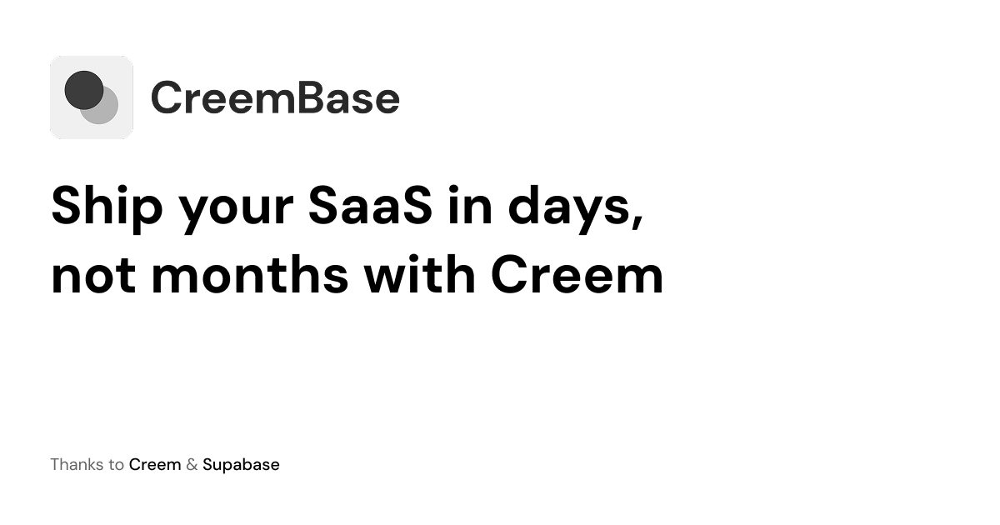

# CreemBase - Next.js + Supabase + Creem SaaS Boilerplate

A production-ready starter template designed to help you launch your SaaS faster. It includes full-stack authentication with Supabase and built-in subscription management and checkout via Creem.

## 🚀 Getting Started: Step-by-Step Setup

Follow these steps to get your project running locally.

### 1. Clone & Install Dependencies

```bash
# Clone your repository (if applicable)
# git clone <your-repo-url>
# cd creembase.pacekit.dev

# Install dependencies using Bun
bun install
```

### 2. Configure Environment Variables

Copy the example environment file:

```bash
cp .env.example .env.local
```

Open `.env.local` and fill in the required variables using the steps below:

#### A. Finding Supabase Variables

1. **Create a Supabase Project**: Go to [Supabase](https://supabase.com) and create a new project.
2. **Database URL**: Go to Project Settings -> Database. Under "Connection string" (URI), copy the link and replace `[YOUR-PASSWORD]` with your actual database password. Set this as `SUPABASE_DB_URL`.
3. **API Keys**: Go to Project Settings -> API.
    - Copy the "URL" and set it as `NEXT_PUBLIC_SUPABASE_URL`.
    - Copy the publishable key (either the older "anon" public key or the newer 2026 `sb_publishable_...` key) and set it as `NEXT_PUBLIC_SUPABASE_PUBLISHABLE_KEY`.
    - Copy the secret key (either the older "service*role" secret key or the newer 2026 `sb_secret*...`key) and set it as`SUPABASE_SERVICE_ROLE_KEY`.

#### B. Finding Creem Variables

1. **Create a Creem Account**: Go to [Creem](https://creem.io) and create or log in to your account.
2. **API Key**: Go to the "Developers" or "API" section in your Creem Dashboard. Generate a new Server API Key and set it as `CREEM_API_KEY`.
3. **Webhook Secret**:
    - Navigate to the Webhooks section in Creem.
    - Add a new webhook endpoint: `http://<your-local-url>/api/webhook/creem` (You can use services like localtunnel/ngrok for local dev, or your production URL later).
    - Once created, Creem will provide a Webhook Secret. Set this as `CREEM_WEBHOOK_SECRET`.
4. **Test Mode**: Leave `CREEM_TEST_MODE=true` for local development.

### 3. Setup the Database Schema

Run the migration script to set up your Supabase database schema automatically:

```bash
bun run setup:db
```

### 4. Create a Demo User (Optional)

You can seed your database with a dummy user for quick testing:

```bash
bun run setup:demo-user
```

### 5. Start Development Server

Run the local development server:

```bash
bun run dev
```

Your app will now be running at `http://localhost:3000`.
Available routes include: `/sign-in`, `/sign-up`, `/payments/pricing`, `/admin`, and `/payments/billing/success`.

---

## 🧪 Testing

End-to-end tests are written using [Playwright](https://playwright.dev/) and cover the complete subscription checkout flow.

```bash
# Run headless tests
bun run test:e2e

# Run tests with the Playwright UI
bun run test:e2e --ui
```

---

## 📚 Deep Dive: Features & Architecture

This section covers how the boilerplate works under the hood and its folder structure.

### 📁 Folder Structure

```
src/
├── app/                  # Next.js App Router (pages, layouts, API routes)
│   ├── (auth)/           # Authentication pages (sign-in, sign-up)
│   ├── (pages)/          # Standard pages (pricing, success flows)
│   ├── admin/            # Protected admin dashboard route
│   └── api/              # API and Webhook endpoints
├── components/           # Reusable UI components
├── features/             # Feature-based modular logic
│   ├── creem/            # Creem subscription integration and plans configuration
│   └── supabase/         # Supabase client instances (browser, server, middleware)
├── hooks/                # Custom React hooks
├── lib/                  # Utility functions and shared helpers
└── styles/               # Global CSS and styling rules
```

### 🔒 Authentication & Database Schema

The database follows a secure, synchronized model.
When a user signs up via Supabase Auth:

1. They are added to the internal `auth.users` table.
2. A Postgres database trigger automatically syncs them to the `public.users` table.

### 💳 Creem Subscriptions & Webhooks

- **Plans Configuration**: Manage your available SaaS plans locally in `src/features/creem/plans.ts` by using the Product IDs from your Creem dashboard.
- **Webhooks**: `public.subscriptions` is updated _only_ when Creem sends a webhook event (e.g., subscription activated/canceled). Changes are written using the `SUPABASE_SERVICE_ROLE_KEY` to bypass Row Level Security (RLS).
- **Security Check**: Creem webhooks are heavily verified server-side using `@creem_io/nextjs` to prevent webhook spoofing.

### 🛡️ Protected Routes

Routes like `/admin` are protected by Edge Middleware or Server Components. The boilerplate checks two things to grant access:

1. **Valid Session**: Checks Supabase for an active user session.
2. **Active Subscription**: Checks `public.subscriptions.is_active` to ensure the user has paid for access. Users without an active subscription are redirected to the pricing page.
